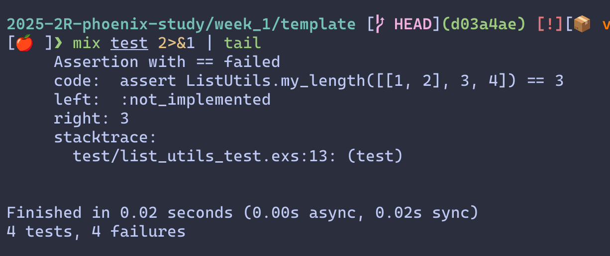
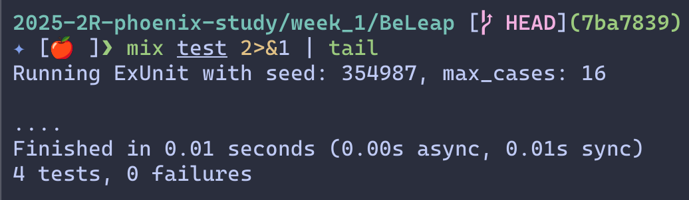

# 1주차: 함수형 기초

[PLAN.md](../docs/STUDY-PLAN.md#1주차-함수형-기초)

## 과제: 리스트 길이 세기

- 현재 template에서 test를 실행하면 4개의 test가 실패합니다

  

- 이번 주의 영역을 학습한 후 본인의 GitHub ID로 되어있는 디렉토리에서 test가 성공하게 만들어서 PR로 제출해주세요

  
